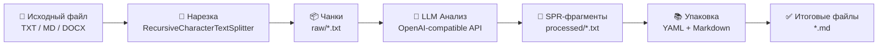

# SimpleETL — Text Processing & SPR Pipeline

**SimpleETL** — это десктопное приложение с графическим интерфейсом (Tkinter) для автоматизированной обработки текстовых документов. Приложение нарезает исходный текст на фрагменты (чанки), отправляет их в LLM-модель для генерации структурированного представления (SPR) и упаковывает результат в готовые Markdown-файлы с метаданными YAML Front Matter.

**Цель приложения** — подготовить структурированные Markdown-файлы с метаданными YAML Front Matter для последующей передачи в embedding-модель при построении RAG-систем (Retrieval-Augmented Generation). Благодаря формату SPR каждый фрагмент содержит не только исходный текст, но и концентрированное смысловое представление: концепцию, алгоритм, формулу, метафору, связи и теги. Это значительно повышает качество семантического поиска при векторизации — embedding-модель получает не «сырой» текст, а обогащённый контекст с явно выделенными связями и ключевыми понятиями, что позволяет RAG-системе точнее находить релевантные фрагменты при генерации ответов.

---

## 📋 Содержание

- [Возможности](#-возможности)
- [Архитектура проекта](#-архитектура-проекта)
- [Установка](#-установка)
- [Конфигурация](#-конфигурация)
- [Использование](#-использование)
- [Формат SPR](#-формат-spr)
- [Поддерживаемые форматы файлов](#-поддерживаемые-форматы-файлов)
- [Структура выходных данных](#-структура-выходных-данных)
- [Зависимости](#-зависимости)

---

## 🚀 Возможности

- **Пакетная обработка** — загрузка нескольких файлов одновременно через диалог выбора (пути разделяются точкой с запятой)
- **Нарезка текста** — автоматическое разбиение документов на чанки с настраиваемым размером и перекрытием
- **LLM-анализ** — отправка каждого чанка в OpenAI-совместимую модель для генерации структурированного SPR-представления
- **Библиотека промптов** — создание, сохранение и переключение между различными системными промптами
- **Автоматическая упаковка** — формирование итоговых Markdown-файлов с YAML Front Matter и отформатированными секциями SPR
- **Два прогресс-бара** — отслеживание прогресса текущего файла и общего прогресса всего пакета
- **Возможность остановки** — graceful shutdown конвейера по запросу пользователя
- **Автоочистка** — удаление временных папок `raw/` и `processed/` после завершения (опционально)
- **Поддержка DOCX** — чтение документов Microsoft Word (формат `.docx`)
- **Сохранение настроек** — все параметры (модель, URL, API-ключ, промпты, размер чанков) сохраняются в `config.json`

---

## 🏗 Архитектура проекта

```
SimpleETL/
├── main_ui.py           # GUI-приложение (Tkinter) — точка входа
├── etl_pipeline.py      # Ядро ETL-конвейера: нарезка → LLM-анализ → упаковка
├── config_manager.py    # Менеджер конфигурации (сохранение/загрузка config.json)
├── config.json          # Файл настроек (генерируется автоматически)
└── README.md            # Документация
```

| Модуль | Ответственность |
|--------|----------------|
| `main_ui.py` | Графический интерфейс, управление вводом/выводом, запуск фоновых потоков |
| `etl_pipeline.py` | Извлечение текста, нарезка на чанки, вызов LLM, парсинг YAML Front Matter, формирование итоговых `.md` файлов |
| `config_manager.py` | Чтение и запись JSON-конфигурации с поддержкой Frozen-режима (PyInstaller) |

### Схема конвейера (ETL)



---

## ⚙️ Установка

### 1. Клонирование репозитория

```bash
git clone <url-репозитория>
cd SimpleETL
```

### 2. Создание виртуального окружения

```bash
python -m venv .venv
```

Активация:

- **Windows:**
  ```powershell
  .venv\Scripts\Activate.ps1
  ```
- **Linux / macOS:**
  ```bash
  source .venv/bin/activate
  ```

### 3. Установка зависимостей

```bash
pip install openai langchain-text-splitters python-frontmatter python-docx
```

### 4. Запуск приложения

```bash
python main_ui.py
```

---

## 🔧 Конфигурация

При первом запуске или нажатии кнопки **«💾 Сохранить настройки»** создаётся файл `config.json`:

| Параметр | Описание | Значение по умолчанию |
|----------|----------|-----------------------|
| `model` | Идентификатор модели LLM | `llama3` |
| `base_url` | Базовый URL OpenAI-совместимого API | `http://localhost:11434/v1` |
| `api_key` | API-ключ для авторизации | `ollama` |
| `chunk_size` | Максимальный размер одного чанка (символы) | `10000` |
| `chunk_overlap` | Перекрытие между соседними чанками (символы) | `1500` |
| `prompts` | Словарь шаблонов системных промптов | Встроенный SPR-промпт |
| `current_prompt_name` | Имя активного промпта | `Дефолтный SPR` |

> **Примечание:** Приложение совместимо с любым OpenAI-совместимым API (Ollama, LM Studio, vLLM, OpenRouter и др.)

---

## 📖 Использование

### Пошаговая инструкция

1. **Выберите входные файлы** — нажмите «Обзор» в секции «Выбор входного файла». Можно выбрать несколько файлов одновременно (Ctrl+Click).

2. **Укажите выходную папку** (опционально) — по умолчанию результат сохраняется в папку рядом с исходным файлом.

3. **Настройте LLM-провайдер** — укажите модель, Base URL и API-ключ.

4. **Настройте промпт** — выберите готовый шаблон из выпадающего списка или отредактируйте текст вручную. Для сохранения нового шаблона нажмите «➕ Сохранить как...».

5. **Запустите обработку** — нажмите **«▶ Начать обработку»**.

6. **Следите за прогрессом** — два прогресс-бара показывают прогресс текущего файла и общий прогресс пакета.

7. **Остановка** — во время обработки кнопка меняется на **«🛑 Остановить обработку»**. Остановка происходит корректно после завершения текущего чанка.

### Горячие клавиши

| Комбинация | Действие |
|------------|----------|
| `Ctrl+V` | Вставить |
| `Ctrl+C` | Копировать |
| `Ctrl+X` | Вырезать |
| `Ctrl+A` | Выделить всё |
| `Ctrl+Z` | Отменить |
| ПКМ | Контекстное меню (Вырезать / Копировать / Вставить / Выделить всё) |

---

## 🧠 Формат SPR

**SPR (Structured Point Representation)** — это концентрированное структурированное представление текстового фрагмента. Каждый чанк преобразуется LLM в следующий формат:

```yaml
---
title: "Краткое техническое название фрагмента"
концепция: "Одно предложение — определение сути текста"
алгоритм: "Пошаговые действия через запятую или цифры"
формула: "Математическое/логическое выражение текстом"
метафора: "Яркая аналогия/сравнение на русском языке"
связи: ["Связь1", "Связь2"]
теги: ["тег1", "тег2"]
---

[Структурированный Markdown текст фрагмента]
```

### Описание полей YAML

| Поле | Назначение |
|------|------------|
| `title` | Краткое техническое описание содержимого чанка |
| `концепция` | Суть фрагмента в одном предложении |
| `алгоритм` | Пошаговая последовательность действий или логика |
| `формула` | Ключевое математическое или логическое выражение |
| `метафора` | Образное сравнение для интуитивного понимания |
| `связи` | Список связей с другими концепциями или фрагментами |
| `теги` | Категории и ключевые слова для навигации по базе знаний |

---

## 📁 Поддерживаемые форматы файлов

| Формат | Расширения | Примечание |
|--------|------------|------------|
| Текстовые | `.txt`, `.md` | Чтение в кодировке UTF-8 |
| Word | `.docx`, `.doc` | Требуется библиотека `python-docx`. Файлы `.doc` (старый формат) необходимо предварительно пересохранить в `.docx` |

---

## 📂 Структура выходных данных

Для каждого обработанного файла создаётся отдельная папка:

```
📁 <Имя_исходного_файла>/
├── 📄 01_Название_фрагмента.md
├── 📄 02_Название_фрагмента.md
├── 📄 03_Название_фрагмента.md
└── ...
```

Каждый итоговый `.md` файл содержит:

1. **Заголовок** — из поля `title` YAML-метаданных
2. **Секция SPR** — концепция, алгоритм, формула, метафора, связи, теги
3. **Полный текст фрагмента** — обработанный LLM Markdown-контент

> При включённой опции «Удалять временные файлы» промежуточные папки `raw/` и `processed/` удаляются автоматически после завершения обработки.

---

## 📦 Зависимости

| Библиотека | Назначение |
|------------|------------|
| `openai` | Клиент для OpenAI-совместимого API |
| `langchain-text-splitters` | Нарезка текста на чанки (`RecursiveCharacterTextSplitter`) |
| `python-frontmatter` | Парсинг YAML Front Matter из ответов LLM |
| `python-docx` | Чтение документов Word `.docx` (опционально) |
| `tkinter` | Графический интерфейс (встроен в Python) |

---

## 📄 Лицензия

Проект разработан для внутреннего использования. Авторские права принадлежат разработчику.
