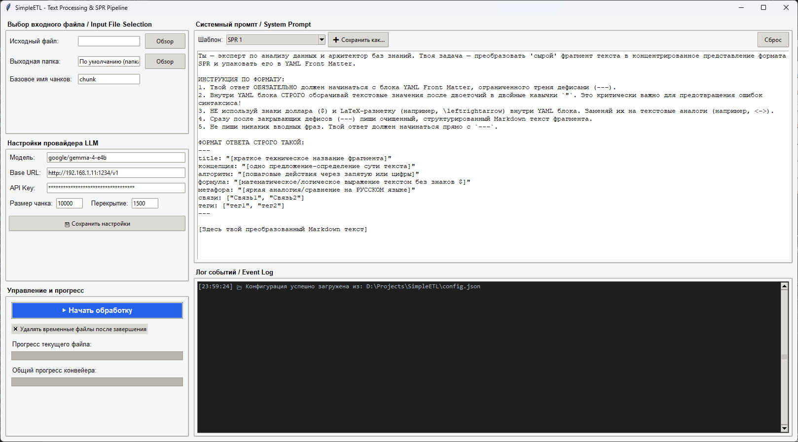
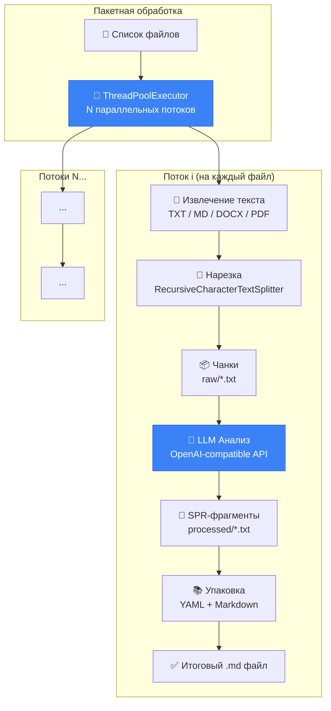

# SimpleETL — Text Processing & SPR Pipeline

**SimpleETL** — это десктопное приложение с современным графическим интерфейсом (CustomTkinter) для автоматизированной обработки текстовых документов. Приложение нарезает исходный текст на фрагменты (чанки), отправляет их в LLM-модель для генерации структурированного представления (SPR) и упаковывает результат в готовые Markdown-файлы с метаданными YAML Front Matter.

**Цель приложения** — подготовить структурированные Markdown-файлы с метаданными YAML Front Matter для последующей передачи в embedding-модель при построении RAG-систем (Retrieval-Augmented Generation). Благодаря формату SPR каждый фрагмент содержит не только исходный текст, но и концентрированное смысловое представление: концепцию, алгоритм, формулу, метафору, связи и теги. Это значительно повышает качество семантического поиска при векторизации — embedding-модель получает не «сырой» текст, а обогащённый контекст с явно выделенными связями и ключевыми понятиями, что позволяет RAG-системе точнее находить релевантные фрагменты при генерации ответов.

**Зачем нужна нарезка?** Отправка в LLM целых документов — десятки и сотни тысяч символов — приводит к двум критическим проблемам: модель «теряет» системные инструкции в потоке пользовательского текста и начинает действовать произвольно, либо документ обрезается на границе контекстного окна, и значительная часть содержимого просто не обрабатывается. Нарезка на управляемые чанки позволяет модели удерживать инструкции в «оперативной памяти» на протяжении всей обработки, последовательно анализируя исходный файл частями. Именно благодаря этому подходу чёткое следование инструкциям достигается даже у компактных моделей с 4B активных параметров — каждый чанк невелик относительно контекстного окна, и модель получает достаточно «внимания» и на инструкции, и на содержимое фрагмента.

**Гибкость промптов.** Несмотря на то что изначально программа создавалась для SPR-обогащения текста, системный промпт можно полностью заменить под другие задачи: суммаризация, извлечение сущностей, классификация, генерация вопросов-ответов, создание заметок Obsidian, перевод и т.д. Встроенная библиотека промптов позволяет сохранять и переключаться между различными шаблонами, превращая SimpleETL в универсальный конвейер текстовой обработки.

### Интерфейс приложения



---

## 📋 Содержание

- [Возможности](#-возможности)
- [Архитектура проекта](#-архитектура-проекта)
- [Установка](#-установка)
- [Конфигурация](#-конфигурация)
- [Использование](#-использование)
- [Форматы вывода](#-форматы-вывода)
- [Поддерживаемые форматы файлов](#-поддерживаемые-форматы-файлов)
- [Структура выходных данных](#-структура-выходных-данных)
- [Зависимости](#-зависимости)

---

## 🚀 Возможности

- **Нарезка текста** — автоматическое разбиение документов на чанки с настраиваемым размером и перекрытием
- **LLM-анализ** — отправка каждого чанка в OpenAI-совместимую модель для генерации структурированного SPR-представления
- **Режим без LLM** — флажок «Только нарезка и конверсия» для быстрой нарезки файлов без обращения к модели
- **Три формата вывода** — `spr` (Markdown-представление), `frontmatter` (настоящий YAML Front Matter), `markdown` (сырой текст)
- **Динамические YAML-поля** — парсинг любых полей из YAML Front Matter, не привязка к конкретному набору
- **Поддержка DOCX** — чтение документов Microsoft Word (формат `.docx`)
- **Поддержка PDF** — чтение PDF-документов с извлечением текста и опциональным OCR для сканов
- **Пакетная обработка** — загрузка нескольких файлов одновременно через диалог выбора
- **Параллельная обработка** — настраиваемое количество параллельных потоков (1–8) для ускорения работы
- **Библиотека промптов** — создание, сохранение, переключение и удаление различных системных промптов
- **Прогресс-бар выбранного файла** — клик по файлу в списке показывает его прогресс в реальном времени
- **Возможность остановки** — graceful shutdown конвейера по запросу пользователя
- **Автоочистка** — удаление временных папок `raw/` и `processed/` после завершения (опционально)
- **Сохранение настроек** — все параметры (модель, URL, API-ключ, промпты, формат вывода) сохраняются в `config.json`

---

## 🏗 Архитектура проекта

```
SimpleETL/
├── main_ui.py           # GUI-приложение (CustomTkinter) — точка входа
├── etl_pipeline.py      # Ядро ETL-конвейера: нарезка → LLM-анализ → упаковка
├── config_manager.py    # Менеджер конфигурации (сохранение/загрузка config.json)
├── config.json          # Файл настроек (генерируется автоматически)
├── assets/              # Ресурсы (скриншоты, иконки)
└── README.md            # Документация
```

| Модуль | Ответственность |
|--------|----------------|
| `main_ui.py` | Графический интерфейс (CustomTkinter), управление вводом/выводом, запуск фоновых потоков |
| `etl_pipeline.py` | Извлечение текста, нарезка на чанки, вызов LLM, парсинг YAML Front Matter, формирование итоговых `.md` файлов |
| `config_manager.py` | Чтение и запись JSON-конфигурации с поддержкой Frozen-режима (PyInstaller) |

### Схема конвейера (ETL)



---

## ⚙️ Установка

### 1. Клонирование репозитория

```bash
git clone <url-репозитория>
cd SimpleETL
```

### 2. Создание виртуального окружения

```bash
python -m venv .venv
```

Активация:

- **Windows:**
  ```powershell
  .venv\Scripts\Activate.ps1
  ```
- **Linux / macOS:**
  ```bash
  source .venv/bin/activate
  ```

### 3. Установка зависимостей

```bash
pip install customtkinter openai langchain-text-splitters python-frontmatter python-docx PyMuPDF pytesseract Pillow
```

> **Примечание:** Для OCR-распознавания сканированных PDF дополнительно требуется установить [Tesseract-OCR](https://github.com/tesseract-ocr/tesseract) на систему. Без Tesseract приложение работает, но не распознаёт изображения в PDF.

### 4. Запуск приложения

```bash
python main_ui.py
```

---

## 🔧 Конфигурация

При первом запуске или нажатии кнопки **«💾 Сохранить настройки»** создаётся файл `config.json`:

| Параметр | Описание | Значение по умолчанию |
|----------|----------|-----------------------|
| `model` | Идентификатор модели LLM | `llama3` |
| `base_url` | Базовый URL OpenAI-совместимого API | `http://localhost:11434/v1` |
| `api_key` | API-ключ для авторизации | `ollama` |
| `chunk_size` | Максимальный размер одного чанка (символы) | `10000` |
| `chunk_overlap` | Перекрытие между соседними чанками (символы) | `1500` |
| `max_workers` | Количество параллельных потоков обработки | `1` |
| `output_format` | Формат выходных файлов: `spr`, `frontmatter`, `markdown` | `spr` |
| `prompts` | Словарь шаблонов системных промптов | Встроенный SPR-промпт |
| `current_prompt_name` | Имя активного промпта | `Дефолтный SPR` |

> **Примечание:** Приложение совместимо с любым OpenAI-совместимым API (Ollama, LM Studio, vLLM, OpenRouter и др.)

---

## 📖 Использование

### Пошаговая инструкция

1. **Выберите входные файлы** — нажмите «➕ Добавить» в секции «Файлы для обработки». Поддерживаются `.txt`, `.md`, `.docx`, `.pdf`. В списке отображаются только имена файлов; полный путь можно увидеть, наведя курсор на файл.

2. **Укажите выходную папку** (опционально) — по умолчанию результат сохраняется в папку рядом с исходным файлом.

3. **Настройте LLM-провайдер** — укажите модель, Base URL и API-ключ.

4. **Настройте параметры обработки** — задайте размер чанка, перекрытие, количество потоков (1–8) и формат вывода (`spr`, `frontmatter`, `markdown`).

5. **Настройте промпт** — выберите готовый шаблон из выпадающего списка или отредактируйте текст вручную. Сохранение нового шаблона — «➕ Сохранить как...», удаление — «🗑 Удалить».

6. **Запустите обработку** — нажмите **«▶ Начать обработку»**.

7. **Следите за прогрессом** — кликните на файл в списке для отображения его прогресса. Общий прогресс конвейера отображается на втором прогресс-баре.

8. **Остановка** — во время обработки кнопка меняется на **«🛑 Остановить обработку»**. Остановка происходит корректно после завершения текущего чанка.

### Горячие клавиши

| Комбинация | Действие |
|------------|----------|
| `Ctrl+V` | Вставить |
| `Ctrl+C` | Копировать |
| `Ctrl+X` | Вырезать |
| `Ctrl+A` | Выделить всё |
| `Ctrl+Z` | Отменить |
| ПКМ | Контекстное меню (Вырезать / Копировать / Вставить / Выделить всё) |

---

## 🧠 Форматы вывода

Приложение поддерживает три формата выходных файлов, выбираемых через выпадающий список «Формат вывода»:

### 1. `spr` (по умолчанию)

Структурированное Markdown-представление. Мета-поля из YAML отображаются как список Markdown, текст фрагмента — в отдельной секции:

```markdown
# Название фрагмента

## 🧠 Краткое представление (SPR)
* **Концепция:** Суть текста
* **Алгоритм:** Шаги...
* **Теги:** #тег1, #тег2

---

## 📄 Полный текст фрагмента
Обработанный LLM текст...
```

### 2. `frontmatter`

Настоящий YAML Front Matter между `---`. Все поля из ответа LLM попадают в YAML автоматически:

```markdown
---
title: "Название фрагмента"
концепция: "Суть текста"
алгоритм: "Шаги..."
tags: ["тег1", "тег2"]
---

Обработанный LLM текст...
```

### 3. `markdown`

Сырой текст нарезки или ответа LLM без какой-либо обработки и структурирования.

> **Динамические поля:** форматы `spr` и `frontmatter` парсят **любые** YAML-поля из ответа LLM — промпт может вернуть произвольный набор ключей, и они все отобразятся в выходном файле.

---

## 📁 Поддерживаемые форматы файлов

| Формат | Расширения | Примечание |
|--------|------------|------------|
| Текстовые | `.txt`, `.md` | Чтение в кодировке UTF-8 |
| Word | `.docx`, `.doc` | Требуется библиотека `python-docx`. Файлы `.doc` (старый формат) необходимо предварительно пересохранить в `.docx` |
| PDF | `.pdf` | Требуется библиотека `PyMuPDF`. Поддерживается извлечение текста и OCR-распознавание сканов (опционально,requires Tesseract-OCR) |

---

## 📂 Структура выходных данных

Для каждого обработанного файла создаётся отдельная папка:

```
📁 <Имя_исходного_файла>/
├── 📄 01_Название_фрагмента.md
├── 📄 02_Название_фрагмента.md
├── 📄 03_Название_фрагмента.md
└── ...
```

Каждый итоговый `.md` файл формируется в зависимости от выбранного формата вывода (см. [Форматы вывода](#-форматы-вывода)).

> При включённой опции «Очищать временные файлы» промежуточные папки `raw/` и `processed/` удаляются автоматически после завершения обработки.

---

## 📦 Зависимости

| Библиотека | Назначение |
|------------|------------|
| `customtkinter` | Современный графический интерфейс с поддержкой тем и скруглённых элементов |
| `openai` | Клиент для OpenAI-совместимого API |
| `langchain-text-splitters` | Нарезка текста на чанки (`RecursiveCharacterTextSplitter`) |
| `python-frontmatter` | Парсинг YAML Front Matter из ответов LLM |
| `python-docx` | Чтение документов Word `.docx` (опционально) |
| `PyMuPDF` | Чтение PDF-документов с извлечением текста |
| `pytesseract` | OCR-распознавание текста на сканированных страницах PDF (опционально, требует Tesseract-OCR) |
| `Pillow` | Обработка изображений для OCR |
| `tkinter` | Базовый GUI-фреймворк (встроен в Python, используется для диалогов и контекстного меню) |

---

## 📄 Лицензия

This project is licensed under the MIT License - see the [LICENSE](LICENSE) file for details.

```
MIT License

Copyright (c) 2026 Haonir

Permission is hereby granted, free of charge, to any person obtaining a copy
of this software and associated documentation files (the "Software"), to deal
in the Software without restriction, including without limitation the rights
to use, copy, modify, merge, publish, distribute, sublicense, and/or sell
copies of the Software, and to permit persons to whom the Software is
furnished to do so, subject to the following conditions:

The above copyright notice and this permission notice shall be included in all
copies or substantial portions of the Software.

THE SOFTWARE IS PROVIDED "AS IS", WITHOUT WARRANTY OF ANY KIND, EXPRESS OR
IMPLIED, INCLUDING BUT NOT LIMITED TO THE WARRANTIES OF MERCHANTABILITY,
FITNESS FOR A PARTICULAR PURPOSE AND NONINFRINGEMENT. IN NO EVENT SHALL THE
AUTHORS OR COPYRIGHT HOLDERS BE LIABLE FOR ANY CLAIM, DAMAGES OR OTHER
LIABILITY, WHETHER IN AN ACTION OF CONTRACT, TORT OR OTHERWISE, ARISING FROM,
OUT OF OR IN CONNECTION WITH THE SOFTWARE OR THE USE OR OTHER DEALINGS IN THE
SOFTWARE.
```

---

## 👤 Автор

**Haonir** — автор и разработчик проекта SimpleETL.

Если вы используете данный код или программу в своих проектах, пожалуйста, укажите авторство:

```
Основано на SimpleETL от Haonir
https://github.com/Haonir/SimpleETL
```

Или добавьте в свой README:

```markdown
## Благодарности

- [SimpleETL](https://github.com/Haonir/SimpleETL) — инструмент для подготовки текстовых данных к RAG-системам, автор [Haonir](https://github.com/Haonir)
```
