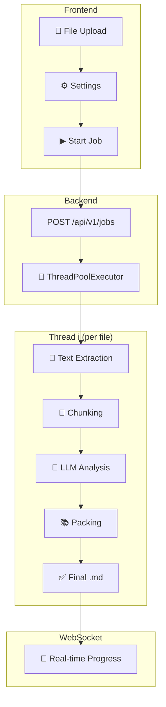

# SimpleETL — Text Processing & SPR Pipeline

**SimpleETL** — web application (Vue 3 + FastAPI) for automated text document processing. Chunks text, sends to LLM for Structured Presentation (SPR) generation and packs the result into Markdown/YAML files for RAG systems.

**Application goal** — prepare structured Markdown files with YAML Front Matter metadata for subsequent transfer to an embedding model when building RAG systems (Retrieval-Augmented Generation). Thanks to the SPR format, each fragment contains not only the original text but also a concentrated semantic representation: concept, algorithm, formula, metaphor, connections and tags. This significantly improves the quality of semantic search during vectorization.

**Why chunking is needed?** Sending entire documents to an LLM leads to two problems: the model "loses" system instructions or the document gets cut off at the context window boundary. Chunking into manageable pieces allows the model to retain instructions and sequentially analyze the file part by part.


---

## 📋 Table of Contents

- [🚀 Features](#-features)
- [🏗 Architecture](#-architecture)
- [⚙️ Installation](#️-installation)
- [🔧 Configuration](#-configuration)
- [📖 Usage](#-usage)
- [🧠 Output Formats](#-output-formats)
- [📁 Supported File Formats](#-supported-file-formats)
- [📡 API](#-api)
- [🧪 Testing](#-testing)
- [📄 License](#-license)
- [👤 Author](#-author)

---

## 🚀 Features

- **Web interface** — modern UI on Vue 3 with settings, progress and real-time logs
- **Text chunking** — automatic document splitting into chunks with configurable size and overlap
- **LLM analysis** — sending each chunk to an OpenAI-compatible model for SPR generation
- **No LLM mode** — fast file chunking without model calls
- **Four output formats** — `spr`, `frontmatter`, `markdown`, `html`
- **Dynamic YAML fields** — parsing any fields from YAML Front Matter
- **DOCX and PDF support** — document reading with optional OCR for scans
- **Batch processing** — uploading multiple files simultaneously
- **Parallel processing** — configurable number of threads (1–8)
- **Prompt library** — creating, saving and switching templates
- **WebSocket progress** — real-time updates via WebSocket
- **API authorization** — optional protection via `X-API-Key` header
- **Server-side caps** — server limits on max_workers and chunk_size

### Interface Preview


---

## 🏗 Architecture

```
SimpleETL/
├── backend/                    # FastAPI backend
│   ├── app/
│   │   ├── main.py             # FastAPI app, CORS, API key middleware
│   │   ├── settings.py         # Pydantic Settings (APP_* env vars)
│   │   ├── api/v1/             # REST endpoints: files, jobs, websocket
│   │   ├── etl/                # ETL pipeline (extractor, splitter, llm_processor, packer)
│   │   ├── services/           # Business logic (file_service, job_service, ws_manager)
│   │   └── schemas/            # Pydantic v2 models
│   ├── tests/                  # pytest tests
│   ├── pyproject.toml          # Dependencies
│   └── .env                    # Environment variables (not in git)
│
├── frontend/                   # Vue 3 + TypeScript SPA
│   ├── src/
│   │   ├── stores/             # Pinia stores (config, files, job, prompts)
│   │   ├── services/           # API client (axios), WebSocket
│   │   ├── components/         # Vue components
│   │   └── types/              # TypeScript interfaces
│   ├── package.json
│   └── vite.config.ts
│
└── README.md
```

### ETL Pipeline Diagram



---

## ⚙️ Installation

### Requirements

- Python 3.10+
- Node.js 18+
- OpenAI-compatible API (Ollama, LM Studio, vLLM)

### 1. Clone

```bash
git clone <repository-url>
cd SimpleETL
```

### 2. Backend

```bash
cd backend
python -m venv .venv
source .venv/bin/activate  # Windows: .venv\Scripts\Activate.ps1
pip install -e ".[dev]"
```

### 3. Frontend

```bash
cd frontend
npm install
```

### 4. Running

**Terminal 1 — Backend:**
```bash
cd backend
source .venv/bin/activate
uvicorn app.main:app --reload --port 8000
```

**Terminal 2 — Frontend:**
```bash
cd frontend
npm run dev
```

Open http://localhost:5173

> **Note:** For OCR recognition of scanned PDFs, additionally install [Tesseract-OCR](https://github.com/tesseract-ocr/tesseract).

### 5. Docker (alternative)

**Quick start:**
```bash
docker compose up
```

Open http://localhost:8000

**Production:**
```bash
docker compose up -d
```

**Data persistence:**

All data is stored as bind mounts on the host:

| Host path | Container path | Purpose |
|-----------|---------------|---------|
| `./data` | `/data` | Uploads, output files, job logs |
| `./backend/simpleetl.db` | `/app/simpleetl.db` | SQLite database |
| `.config.json` | `/app/static/config.json` | Frontend configuration |

**Custom port:**
```bash
APP_SERVER_PORT=9000 docker compose up
```

### 6. Split Deployment (Frontend + Backend on separate machines)

**Architecture:**
```
Machine 1 (Nginx)              Machine 2 (Backend)
┌─────────────────────┐       ┌─────────────────┐
│ Nginx :80/443       │       │ simpleetl :8000 │
│ ├── /               │──────▶│ API + WebSocket  │
│ │   static Vue SPA  │ proxy │                  │
│ └── /api/* /ws/*    │       │                  │
└─────────────────────┘       └─────────────────┘
```

**Step 1 — Build frontend (any machine with Node.js):**
```bash
cd frontend
npm install
npm run build
# Output: frontend/dist/
```

**Step 2 — Copy to Nginx server:**
```bash
scp -r frontend/dist/* user@frontend-server:/var/www/simpleetl/
```

**Step 3 — Configure and start Nginx:**
```bash
# Copy nginx.conf to the server, update backend address
# Then:
docker compose -f docker-compose.frontend.yml up -d
```

**Step 4 — Start backend:**
```bash
docker compose -f docker-compose.backend.yml up -d
```

**Step 5 — Configure backend URL in UI:**

Open the frontend → Settings → set backend URL (e.g., `https://api.example.com`). The URL is saved in localStorage — no rebuild needed.

> **Note:** No `.env` configuration needed for the frontend. Users set the backend URL directly in the UI settings.

---

## 🔧 Configuration

### Environment Variables

#### Backend (`backend/.env`)

| Variable | Default | Description |
|----------|---------|-------------|
| `APP_SERVER_PORT` | `8000` | uvicorn port |
| `APP_MAX_WORKERS_LIMIT` | `1` | Max threads (server cap) |
| `APP_CHUNK_SIZE_LIMIT` | `10000` | Max chunk size (server cap) |
| `APP_API_KEY` | *(empty)* | API key for authorization |
| `CORS_ORIGINS` | `http://localhost:5173,http://localhost:8000` | Allowed origins |

> **Caps:** If the user requests a value **below** the limit — their value is used. If **above** — it's capped to the limit. Limit = 0 disables the cap.

#### Frontend (`frontend/.env`)

| Variable | Default | Description |
|----------|---------|-------------|
| `VITE_API_BASE_URL` | *(empty)* | REST API URL (empty = same-origin) |
| `VITE_WS_BASE_URL` | *(empty)* | WebSocket URL (empty = auto-detect) |

### ETL Configuration

ETL configuration is sent from the frontend in the request body when creating a job:

| Parameter | Default | Description |
|-----------|---------|-------------|
| `model` | `llama3` | LLM model |
| `base_url` | `http://localhost:11434/v1` | OpenAI-compatible API endpoint |
| `api_key` | `ollama` | Provider API key |
| `chunk_size` | `10000` | Chunk size (characters) |
| `chunk_overlap` | `1500` | Chunk overlap |
| `max_workers` | `1` | Number of threads |
| `output_format` | `spr` | Output format: `spr`, `frontmatter`, `markdown`, `html` |

---

## 📖 Usage

1. **Upload files** — drag and drop or select `.txt`, `.md`, `.docx`, `.pdf`
2. **Configure LLM** — specify model, URL and API key in the "Settings" section
3. **Select prompt** — use a built-in one or create your own
4. **Start processing** — click ▶ Start
5. **Track progress** — logs and progress update in real time via WebSocket
6. **Download results** — ready files are available for download as a ZIP archive

---

## 🧠 Output Formats

### 1. `spr` (default)

Structured Markdown representation with YAML metadata:

```markdown
# Fragment Title

## 🧠 Brief Representation (SPR)
* **Concept:** Text essence
* **Algorithm:** Steps...
* **Tags:** #tag1, #tag2

---

## 📄 Full Fragment Text
Processed text...
```

### 2. `frontmatter`

YAML Front Matter between `---`:

```markdown
---
title: "Fragment Title"
concept: "Text essence"
algorithm: "Steps..."
tags: ["tag1", "tag2"]
---

Processed text...
```

### 3. `markdown`

Raw text without structuring.

> **Dynamic fields:** `spr` and `frontmatter` formats parse **any** YAML fields from the LLM response.

---

### 4. `html`

Ready HTML document, converted from Markdown:

```html
<!DOCTYPE html>
<html lang="en">
<head><title>Fragment Title</title></head>
<body>
<h1>Fragment Title</h1>
<p>Processed text...</p>
</body>
</html>
```

---

## 📁 Supported File Formats

| Format | Extensions | Notes |
|--------|------------|-------|
| Text | `.txt`, `.md` | UTF-8 |
| Word | `.docx` | Requires `python-docx` |
| PDF | `.pdf` | Requires `PyMuPDF`. OCR optional (Tesseract) |

---

## 📡 API

### REST Endpoints

```
POST   /api/v1/files/upload        # File upload
GET    /api/v1/files               # List files
DELETE /api/v1/files/{id}          # Delete file

POST   /api/v1/jobs                # Create and start job
GET    /api/v1/jobs                # List jobs
GET    /api/v1/jobs/{id}           # Job status
DELETE /api/v1/jobs/{id}           # Stop/delete job
GET    /api/v1/jobs/{id}/files     # Output files list
GET    /api/v1/jobs/{id}/download  # ZIP download

WS     /ws/{job_id}                # WebSocket progress/logs
```

### Request Example

```bash
# File upload
curl -X POST http://localhost:8000/api/v1/files/upload \
  -F "file=@document.pdf"

# Create job
curl -X POST http://localhost:8000/api/v1/jobs \
  -H "Content-Type: application/json" \
  -d '{
    "file_ids": ["file-id-1"],
    "config": {
      "llm": {
        "model": "llama3",
        "base_url": "http://localhost:11434/v1",
        "api_key": "ollama"
      },
      "processing": {
        "chunk_size": 10000,
        "chunk_overlap": 1500,
        "max_workers": 2
      },
      "output_format": "spr"  // spr | frontmatter | markdown | html
    }
  }'
```

---

## 🧪 Testing

```bash
# Backend tests
cd backend
pytest

# Frontend tests
cd frontend
npm test

# Watch mode
npm run test:watch
```

---

## 📦 Dependencies

### Backend

| Library | Purpose |
|---------|---------|
| `fastapi` | Web framework |
| `uvicorn[standard]` | ASGI server |
| `pydantic-settings` | Configuration via env vars |
| `python-multipart` | File upload (multipart/form-data) |
| `aiofiles` | Async file operations |
| `openai` | Client for OpenAI-compatible API |
| `langchain-text-splitters` | Text chunking |
| `python-frontmatter` | YAML Front Matter parsing |
| `python-docx` | Reading `.docx` |
| `PyMuPDF` | PDF reading |
| `markdown` | Markdown → HTML conversion |
| `Pillow` | Image processing |
| `pytesseract` | OCR (optional, `pip install -e ".[ocr]"`) |

### Frontend

| Library | Purpose |
|---------|---------|
| `vue 3` | UI framework |
| `pinia` | State management |
| `axios` | HTTP client |
| `vue-i18n` | Localization (i18n) |
| `marked` | Markdown rendering |
| `@lucide/vue` | Icons |
| `vite` | Build tool |
| `typescript` | Typing |
| `vitest` | Testing |

---

## 📄 License

This project is licensed under the MIT License - see the [LICENSE](LICENSE) file for details.

---

## 👤 Author

**Haonir** — author and developer of the SimpleETL project.

https://github.com/Haonir/SimpleETL
