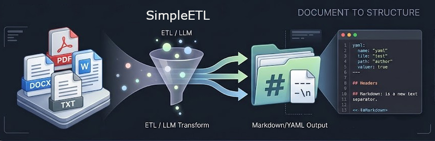
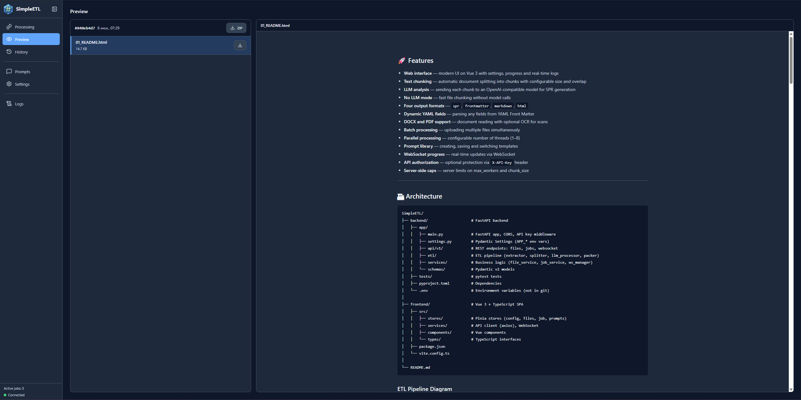
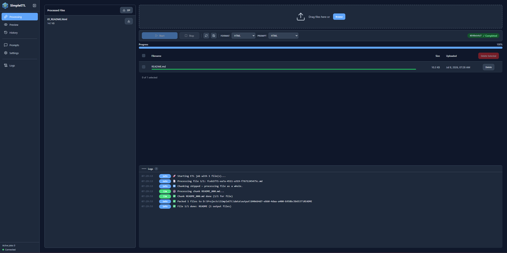
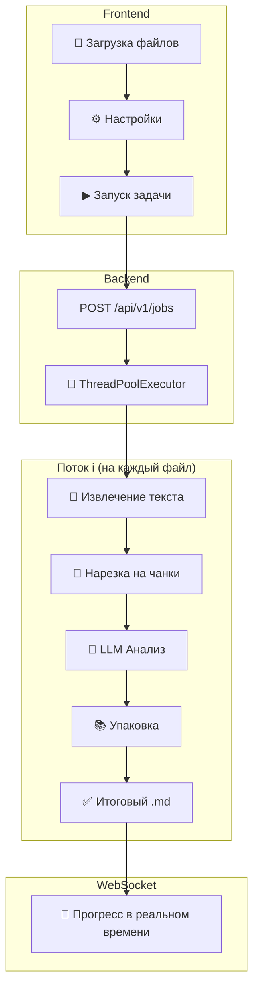

# SimpleETL — Text Processing & SPR Pipeline

**SimpleETL** — веб-приложение (Vue 3 + FastAPI) для автоматизированной обработки текстовых документов. Нарезает текст на чанки, отправляет в LLM для генерации структурированного представления (SPR) и упаковывает результат в Markdown/YAML файлы для RAG-систем.

**Цель приложения** — подготовить структурированные Markdown-файлы с метаданными YAML Front Matter для последующей передачи в embedding-модель при построении RAG-систем (Retrieval-Augmented Generation). Благодаря формату SPR каждый фрагмент содержит не только исходный текст, но и концентрированное смысловое представление: концепцию, алгоритм, формулу, метафору, связи и теги. Это значительно повышает качество семантического поиска при векторизации.

**Зачем нужна нарезка?** Отправка в LLM целых документов приводит к двум проблемам: модель «теряет» системные инструкции или документ обрезается на границе контекстного окна. Нарезка на управляемые чанки позволяет модели удерживать инструкции и последовательно анализировать файл частями.



---

## 📋 Содержание

- [🚀 Возможности](#-возможности)
- [🏗 Архитектура](#-архитектура)
- [⚙️ Установка](#️-установка)
- [🔧 Конфигурация](#-конфигурация)
- [📖 Использование](#-использование)
- [🧠 Форматы вывода](#-форматы-вывода)
- [📁 Поддерживаемые форматы файлов](#-поддерживаемые-форматы-файлов)
- [📡 API](#-api)
- [🧪 Тестирование](#-тестирование)
- [📄 Лицензия](#-лицензия)
- [👤 Автор](#-автор)

---

## 🚀 Возможности

- **Веб-интерфейс** — современный UI на Vue 3 с настройками, прогрессом и логами в реальном времени
- **Нарезка текста** — автоматическое разбиение документов на чанки с настраиваемым размером и перекрытием
- **LLM-анализ** — отправка каждого чанка в OpenAI-совместимую модель для генерации SPR
- **Режим без LLM** — быстрая нарезка файлов без обращения к модели
- **Четыре формата вывода** — `spr`, `frontmatter`, `markdown`, `html`
- **Динамические YAML-поля** — парсинг любых полей из YAML Front Matter
- **Поддержка DOCX и PDF** — чтение документов с опциональным OCR для сканов
- **Пакетная обработка** — загрузка нескольких файлов одновременно
- **Параллельная обработка** — настраиваемое количество потоков (1–8)
- **Библиотека промптов** — создание, сохранение и переключение шаблонов
- **WebSocket прогресс** — обновления в реальном времени через WebSocket
- **API-авторизация** — опциональная защита через `X-API-Key` заголовок
- **Server-side caps** — серверные ограничения на max_workers и chunk_size

### Интерфейс приложения





---

## 🏗 Архитектура

```
SimpleETL/
├── backend/                    # FastAPI backend
│   ├── app/
│   │   ├── main.py             # FastAPI app, CORS, API key middleware
│   │   ├── settings.py         # Pydantic Settings (APP_* env vars)
│   │   ├── api/v1/             # REST endpoints: files, jobs, websocket
│   │   ├── etl/                # ETL pipeline (extractor, splitter, llm_processor, packer)
│   │   ├── services/           # Business logic (file_service, job_service, ws_manager)
│   │   └── schemas/            # Pydantic v2 models
│   ├── tests/                  # pytest тесты
│   ├── pyproject.toml          # Dependencies
│   └── .env                    # Environment variables (не в git)
│
├── frontend/                   # Vue 3 + TypeScript SPA
│   ├── src/
│   │   ├── stores/             # Pinia stores (config, files, job, prompts)
│   │   ├── services/           # API client (axios), WebSocket
│   │   ├── components/         # Vue components
│   │   └── types/              # TypeScript interfaces
│   ├── package.json
│   └── vite.config.ts
│
└── README.md
```

### Схема конвейера (ETL)



---

## ⚙️ Установка

### Требования

- Python 3.10+
- Node.js 18+
- OpenAI-совместимый API (Ollama, LM Studio, vLLM)

### 1. Клонирование

```bash
git clone <url-репозитория>
cd SimpleETL
```

### 2. Backend

```bash
cd backend
python -m venv .venv
source .venv/bin/activate  # Windows: .venv\Scripts\Activate.ps1
pip install -e ".[dev]"
```

### 3. Frontend

```bash
cd frontend
npm install
```

### 4. Запуск

**Terminal 1 — Backend:**
```bash
cd backend
source .venv/bin/activate
uvicorn app.main:app --reload --port 8000
```

**Terminal 2 — Frontend:**
```bash
cd frontend
npm run dev
```

Откройте http://localhost:5173

> **Примечание:** Для OCR-распознавания сканированных PDF дополнительно установите [Tesseract-OCR](https://github.com/tesseract-ocr/tesseract).

### 5. Docker (альтернатива)

**Быстрый старт:**
```bash
docker compose up
```

Откройте http://localhost:8000

**Продакшен:**
```bash
docker compose up -d
```

**Персистентность данных:**

Все данные хранятся как bind mounts на хосте:

| Путь на хосте | Путь в контейнере | Назначение |
|---------------|-------------------|------------|
| `./data` | `/data` | Загрузки, выходные файлы, логи задач |
| `./backend/simpleetl.db` | `/app/simpleetl.db` | SQLite база данных |
| `.config.json` | `/app/static/config.json` | Конфигурация фронтенда |

**Кастомный порт:**
```bash
APP_SERVER_PORT=9000 docker compose up
```

### 6. Раздельный деплой (Фронт + Бэк на разных машинах)

**Архитектура:**
```
Машина 1 (Nginx)               Машина 2 (Бэкенд)
┌─────────────────────┐       ┌─────────────────┐
│ Nginx :80/443       │       │ simpleetl :8000 │
│ ├── /               │──────▶│ API + WebSocket  │
│ │   static Vue SPA  │ proxy │                  │
│ └── /api/* /ws/*    │       │                  │
└─────────────────────┘       └─────────────────┘
```

**Шаг 1 — Сборка фронта (любая машина с Node.js):**
```bash
cd frontend
npm install
npm run build
# Результат: frontend/dist/
```

**Шаг 2 — Копирование на сервер с Nginx:**
```bash
scp -r frontend/dist/* user@frontend-server:/var/www/simpleetl/
```

**Шаг 3 — Настройка и запуск Nginx:**
```bash
# Скопировать nginx.conf на сервер, указать адрес бэкенда
# Затем:
docker compose -f docker-compose.frontend.yml up -d
```

**Шаг 4 — Запуск бэкенда:**
```bash
docker compose -f docker-compose.backend.yml up -d
```

**Шаг 5 — Указание URL бэкенда в UI:**

Откройте фронтенд → Настройки → укажите URL бэкенда (например, `https://api.example.com`). URL сохраняется в localStorage — пересборка не нужна.

> **Примечание:** Для фронта не нужен `.env` файл. Пользователи указывают URL бэкенда прямо в настройках интерфейса.

---

## 🔧 Конфигурация

### Environment Variables

#### Backend (`backend/.env`)

| Переменная | По умолчанию | Описание |
|------------|--------------|----------|
| `APP_SERVER_PORT` | `8000` | Порт uvicorn |
| `APP_MAX_WORKERS_LIMIT` | `1` | Максимум потоков (серверный cap) |
| `APP_CHUNK_SIZE_LIMIT` | `10000` | Максимальный размер чанка (серверный cap) |
| `APP_API_KEY` | *(пусто)* | API-ключ авторизации |
| `CORS_ORIGINS` | `http://localhost:5173,http://localhost:8000` | Разрешённые origins |

> **Caps:** Если пользователь запрашивает значение **ниже** лимита — используется его значение. Если **выше** — режется до лимита. Лимит = 0 отключает cap.

#### Frontend (`frontend/.env`)

| Переменная | По умолчанию | Описание |
|------------|--------------|----------|
| `VITE_API_BASE_URL` | *(пусто)* | URL REST API (пусто = same-origin) |
| `VITE_WS_BASE_URL` | *(пусто)* | URL WebSocket (пусто = auto-detect) |

### ETL Configuration

Конфигурация ETL передаётся с фронта в теле запроса при создании задачи:

| Параметр | По умолчанию | Описание |
|----------|--------------|----------|
| `model` | `llama3` | Модель LLM |
| `base_url` | `http://localhost:11434/v1` | OpenAI-совместимый API endpoint |
| `api_key` | `ollama` | API-ключ провайдера |
| `chunk_size` | `10000` | Размер чанка (символы) |
| `chunk_overlap` | `1500` | Перекрытие чанков |
| `max_workers` | `1` | Количество потоков |
| `output_format` | `spr` | Формат вывода: `spr`, `frontmatter`, `markdown`, `html` |

---

## 📖 Использование

1. **Загрузите файлы** — перетащите или выберите `.txt`, `.md`, `.docx`, `.pdf`
2. **Настройте LLM** — укажите модель, URL и API-ключ в разделе «Настройки»
3. **Выберите промпт** — используйте встроенный или создайте свой
4. **Запустите обработку** — нажмите «▶ Начать»
5. **Следите за прогрессом** — логи и прогресс обновляются в реальном времени через WebSocket
6. **Скачайте результат** — готовые файлы доступны для скачивания в ZIP-архиве

---

## 🧠 Форматы вывода

### 1. `spr` (по умолчанию)

Структурированное Markdown-представление с YAML-метаданными:

```markdown
# Название фрагмента

## 🧠 Краткое представление (SPR)
* **Концепция:** Суть текста
* **Алгоритм:** Шаги...
* **Теги:** #тег1, #тег2

---

## 📄 Полный текст фрагмента
Обработанный текст...
```

### 2. `frontmatter`

YAML Front Matter между `---`:

```markdown
---
title: "Название фрагмента"
концепция: "Суть текста"
алгоритм: "Шаги..."
tags: ["тег1", "тег2"]
---

Обработанный текст...
```

### 3. `markdown`

Сырой текст без структурирования.

> **Динамические поля:** форматы `spr` и `frontmatter` парсят **любые** YAML-поля из ответа LLM.

---

### 4. `html`

Готовый HTML-документ, конвертированный из Markdown:

```html
<!DOCTYPE html>
<html lang="en">
<head><title>Название фрагмента</title></head>
<body>
<h1>Название фрагмента</h1>
<p>Обработанный текст...</p>
</body>
</html>
```

---

## 📁 Поддерживаемые форматы файлов

| Формат | Расширения | Примечание |
|--------|------------|------------|
| Текстовые | `.txt`, `.md` | UTF-8 |
| Word | `.docx` | Требуется `python-docx` |
| PDF | `.pdf` | Требуется `PyMuPDF`. OCR опционален (Tesseract) |

---

## 📡 API

### REST Endpoints

```
POST   /api/v1/files/upload        # Загрузка файла
GET    /api/v1/files               # Список файлов
DELETE /api/v1/files/{id}          # Удаление файла

POST   /api/v1/jobs                # Создание и запуск задачи
GET    /api/v1/jobs                # Список задач
GET    /api/v1/jobs/{id}           # Статус задачи
DELETE /api/v1/jobs/{id}           # Остановка/удаление задачи
GET    /api/v1/jobs/{id}/files     # Список выходных файлов
GET    /api/v1/jobs/{id}/download  # ZIP-скачивание

WS     /ws/{job_id}                # WebSocket прогресс/логи
```

### Пример запроса

```bash
# Загрузка файла
curl -X POST http://localhost:8000/api/v1/files/upload \
  -F "file=@document.pdf"

# Создание задачи
curl -X POST http://localhost:8000/api/v1/jobs \
  -H "Content-Type: application/json" \
  -d '{
    "file_ids": ["file-id-1"],
    "config": {
      "llm": {
        "model": "llama3",
        "base_url": "http://localhost:11434/v1",
        "api_key": "ollama"
      },
      "processing": {
        "chunk_size": 10000,
        "chunk_overlap": 1500,
        "max_workers": 2
      },
      "output_format": "spr"  // spr | frontmatter | markdown | html
    }
  }'
```

---

## 🧪 Тестирование

```bash
# Backend tests
cd backend
pytest

# Frontend tests
cd frontend
npm test

# Watch mode
npm run test:watch
```

---

## 📦 Зависимости

### Backend

| Библиотека | Назначение |
|------------|------------|
| `fastapi` | Веб-фреймворк |
| `uvicorn[standard]` | ASGI-сервер |
| `pydantic-settings` | Конфигурация через env vars |
| `python-multipart` | Загрузка файлов (multipart/form-data) |
| `aiofiles` | Асинхронные файловые операции |
| `openai` | Клиент для OpenAI-совместимого API |
| `langchain-text-splitters` | Нарезка текста на чанки |
| `python-frontmatter` | Парсинг YAML Front Matter |
| `python-docx` | Чтение `.docx` |
| `PyMuPDF` | Чтение PDF |
| `markdown` | Конвертация Markdown → HTML |
| `Pillow` | Обработка изображений |
| `pytesseract` | OCR (опционально, `pip install -e ".[ocr]"`) |

### Frontend

| Библиотека | Назначение |
|------------|------------|
| `vue 3` | UI-фреймворк |
| `pinia` | State management |
| `axios` | HTTP-клиент |
| `vue-i18n` | Локализация (i18n) |
| `marked` | Рендеринг Markdown |
| `@lucide/vue` | Иконки |
| `vite` | Build tool |
| `typescript` | Типизация |
| `vitest` | Тестирование |

---

## 📄 Лицензия

This project is licensed under the MIT License - see the [LICENSE](LICENSE) file for details.

---

## 👤 Автор

**Haonir** — автор и разработчик проекта SimpleETL.

https://github.com/Haonir/SimpleETL
